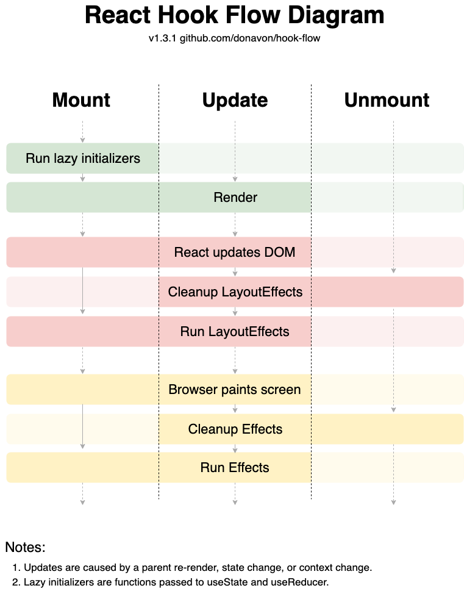

# 과제 01 - 리액트 주요 개념 정리해 보기

---

<details style="margin-bottom: 20px;">
  <summary style="font-size: 26px"><strong>01. 가상 DOM</strong></summary>
<div markdown="1">

#### 가상 DOM의 장점

- **가상 DOM**은 실제 DOM을 흉내 낸 가상의 DOM입니다.
- **성능 향상:** React 같은 라이브러리는 가상 DOM을 사용해서 **<span style="background-color:#fff5b1"> 실제 DOM보다 빠르게 UI 변경사항을 관리합니다</span>**.
- 가상 DOM을 이용하면 변경이 필요한 부분만 실제 DOM에 반영해줘서, 페이지 전체를 새로 불러오지 않아 훨씬 효율적입니다.
- 이를 통해 높은 생산성과 서비스를 만들 수 있게 되었습니다.

  </div>
</details>

<details style="margin-bottom: 20px;">
  <summary style="font-size: 26px"><strong>02. JSX</strong></summary>

<details style="margin-bottom: 20px; margin-left: 20px">
<summary style="font-size: 18px"><strong>01. JSX의 정의</strong></summary>
<div markdown="1">

- JSX는 JavaScript를 확장한 문법으로, React에서 UI 구조를 표현하는데 사용합니다.
- HTML 태그와 유사하게 생겼지만 **<span style="background-color:#FFE6E6"> Javascript를 확장한 문법으로 완전히 다른 것 입니다. </span>**
- JSX는 React 라이브러리의 createElement 함수 호출을 보다 직관적으로 표현해주는 문법적 편의를 제공하는 데에 불과합니다.

```javascript
// createElement
const element = document.createElement("div");
element.setAttribute("id", "myDiv");
// JSX
const element = <div id="myDiv"></div>;
```

</details>

<details style="margin-bottom: 20px; margin-left: 20px">
<summary style="font-size: 18px"><strong>02. JSX의 특징 및 장점</strong></summary>
<div markdown="1">

1. HTML과 유사한 문법
   - JSX는 HTML 태그와 비슷하게 생겼기 때문에, 웹 개발자에게 친숙하고 가독성이 좋습니다.
   - 컴포넌트의 구조를 한눈에 파악하기 쉬워, 프로젝트의 유지보수성이 향상됩니다.
2. Javascript와의 결합
   - JSX 내에서 Javascript 표현식을 중괄호 {}로 묶어 사용할 수 있습니다.
   - 이를 통해 데이터 바인딩이나 반복문 처리 등이 가능합니다.

```javascript
function App() {
  const name = "Young";

  return <div>Hello~! My name is {name}.</div>;
}
```

3. 컴포넌트 기반

   - 리액트는 컴포넌트를 JSX를 사용하여 리액트 엘리먼트로 만들 수 있습니다.
   - 이를 통해 UI를 구조화하고 재사용할 수 있습니다.

4. 사용 예시

```javascript
// 컴포넌트 정의
function Welcome(props) {
  return <h1>Hello, {props.name}</h1>;
}

// 엘리먼트  생성
const element = <Welcome name="John" />;

// 컴포넌트의 재사용
function WelcomeComponent() {
  return (
    <div>
      <Welcome name="John" /> // "Hello, John"
      {element} // "Hello, John"
    </div>
  );
}
```

</details>

<details style="margin-bottom: 20px; margin-left: 20px">
<summary style="font-size: 18px"><strong>03. JSX의 주의사항</strong></summary>
<div markdown="1">

- 브라우저는 JavaScript의 확장인 JSX는 읽지 못하고 JavaScript만 읽을 수 있습니다.
- JSX는 트랜스파일러(Babel 등)를 사용하여 JSX를 일반 JavaScript로 변환하여 웹 브라우저에 보내줘야 합니다.

</details>

  </div>
</details>

<details style="margin-bottom: 20px;">
  <summary style="font-size: 26px"><strong>03. React Component vs React Element</strong></summary>
  <div markdown="1">

1. **리액트 컴포넌트(React Component)**

   - 리액트 컴포넌트는 UI의 한 부분을 캡슐화한 코드 블록입니다.

   - 과거에는 클래스를 사용하여 컴포넌트를 만들었지만 이제는 함수로 만드는 것이 일반적인 방법입니다.

2. **리액트 엘리먼트 (React Element)**

   - 리액트 엘리먼트는 컴포넌트의 인스턴스로, 화면에 표시할 내용을 기술한 객체입니다.

   - JSX 문법을 사용해서 생성할 수 있습니다.

```javascript
// 리액트 컴포넌트
function Greeting() {
  // 컴포넌트
  return <div>Hello World</div>;
}
const SomeComponent = Greeting; // 컴포넌트
// 리액트 엘리먼트
<Greeting />;
const someElement1 = Greeting(); // 엘리먼트
const someElement2 = <Greeting />; // 엘리먼트
```

  </div>
</details>

<details style="margin-bottom: 20px;">
  <summary style="font-size: 26px"><strong>04. State</strong></summary>
  <div markdown="1">

- State는 리액트 컴포넌트 내부의 동적인 데이터를 관리하는데 사용하는 데이터 구조입니다.
- 일반적으로 시간, 사용자의 상호작용, 네트워크 응답 등에 의해 변경되는 값을 State로 관리합니다.
- **State가 바뀌면 컴포넌트는 리렌더링을 합니다.**
- 리렌더링이 된다는 것은 함수가 재실행 되는 것을 뜻하고 그 결과 화면이 다시 그려지게 됩니다.
- 함수가 재실행되도 상태값은 어딘가에 계속 기억되고 있습니다.

```javascript
import React, { useState } from "react";

function Counter() {
  const [count, setCount] = useState(0); // 초기값 0
  let count2 = 0; // 함수가 재실행되어서 count2의 값은 0 또는 1 밖에 안됌
  const increment = () => {
    setCount(count + 1); // count를 1 증가시키는 함수
    count2++;
  };

  return (
    <div>
      <p>현재 카운트: {count}</p> // 값이 증가되는 것이 화면에 표시
      <p>현재 카운트2: {count2}</p> // state가 아니여서 리렌더링이 안 됨 화면에 표시X
      <button onClick={increment}>증가</button>
    </div>
  );
}
```

  </div>
</details>

<details style="margin-bottom: 20px;">
  <summary style="font-size: 26px"><strong>05. Props</strong></summary>
  <div markdown="1">

- **Props**: 부모 컴포넌트로부터 자식 컴포넌트에 전달하는 데이터입니다.
- 자식 컴포넌트 입장에서 Props는 읽기 전용으로, 수정해서는 안됍니다.
- props를 잘 사용하면 컴포넌트의 재사용성과 유연성이 크게 증가합니다.

```javascript
function Greeting(props) {
  // 자식 컴포넌트
  return <h1>안녕하세요, {props.name}님!</h1>;
}

function App() {
  const someName = "철수";
  return (
    <div>
      <Greeting name="지수" /> // 부모 컴포넌트, "지수" = props
      <Greeting name={someName} /> // 부모 컴포넌트, someName = "철수" = props
    </div>
  );
}
```

  </div>
</details>

<details style="margin-bottom: 20px;">
  <summary style="font-size: 26px"><strong>06. 리렌더링의 조건 ⭐</strong></summary>
  <div markdown="1">

1. **state가 변경**되면 리렌더링 됩니다.
2. 부모 컴포넌트로부터 **전달 받는 props의 값이 변경**되면 컴포넌트는 리렌더링됩니다.
3. **부모 컴포넌트가 리렌더링되면** 자식 컴포넌트도 리렌더링된다.
   - 부모 컴포넌트가 리렌더링 될 때 자식 컴포넌트가 리렌더링 되지 않으려면 React.memo를 사용하면 됩니다.

```javascript
// 메모이제이션은 비용이 많이 드는 함수 호출의 결과를 저장하고 동일한 입력이 다시 발생할 때 캐시된 결과를 반환하여 컴퓨터 프로그램의 속도를 높이는데 주로 사용되는 최적화 기술입니다.
// 컴포넌트가 동일한 props로 동일한 결과를 렌더링해낸다면, React.memo를 호출하고 결과를 메모이징(Memoizing)하도록 래핑하여 경우에 따라 성능 향상을 기대할 수 있습니다.
import React from "react";

const ChildComponent = React.memo(({ count }) => {
  //memo로 감싸준 부분
  return <div>{count}</div>;
});

function ParentComponent() {
  const [count, setCount] = useState(0);

  const increment = () => {
    setCount(count + 1);
  };

  return (
    <>
      <button onClick={increment}>증가</button>
      <ChildComponent count={count} />
    </>
  );
}

export default App;
```

  </div>
</details>

<details style="margin-bottom: 20px;">
  <summary style="font-size: 26px"><strong>07. React Component의 생애주기</strong></summary>
  <div markdown="1">



1. Run Lazy Initializers: 처음부터 값을 할당하지 않고 변수가 사용될 때까지 값을 할당하지 않는 것

```javascript
// 일반적인 useState 사용법
const [getter, setter] = useState(initialValue);
// Lazy Initializers(레이지 초기화)
const [getter, setter] = useState(() => {});
// 레이지 초기화를 통해 초기화 된 상태는 컴포넌트가 마운트 될 때만 실행이 된다.
```

2. Render(가상 DOM의 재조정): 함수 컴포넌트 내부 코드가 실행되는 타이밍. 이 때 가상 DOM에서 발생할 변경점들이 기록됩니다.
3. React updates DOM: 이전 단계인 Render에서 기록된 변경점들이 가상 DOM에 적용되는 시점입니다.
4. Run LayoutEffects: React 컴포넌트가 실제 DOM 업데이트 후에 발생하는 단계입니다. 이 단계에서는 DOM 업데이트 이후에 발생하는 레이아웃 효과나 레이아웃 관련 작업을 수행할 때 사용됩니다.
5. Browser Paints Screen: 가상DOM에 발생한 변경점들을 브라우저 DOM에 적용하는 시점입니다. 이 단계가 끝나면 유저는 화면에 컴포넌트가 표시된 것을 볼 수 있습니다.
6. Cleanup Effect: useEffect나 useLayoutEffect 훅에서 반환된 클린업 함수가 호출됩니다. 클린업 함수는 컴포넌트가 소멸되기 직전에 실행되며, 이전에 설정된 이펙트를 정리하거나 리소스를 해제하는 작업을 수행합니다.
7. Run Effect: useEffect 또는 useLayoutEffect 훅에서 정의된 이펙트 함수가 호출되는 단계입니다.

### 메모

- 업데이트는 상위 렌더링, state 변경 또는 컨텍스트 변경으로 인해 발생합니다.
- 지연 초기화자는 useState 및 useReducer에 전달되는 함수입니다.

  </div>
</details>
